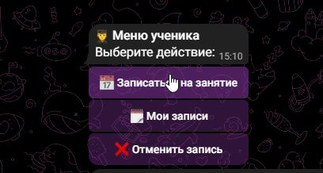
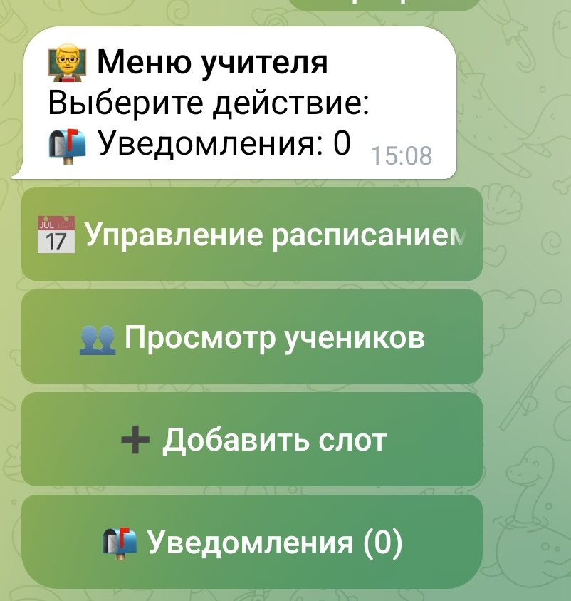
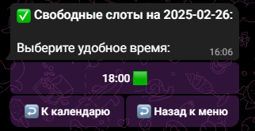
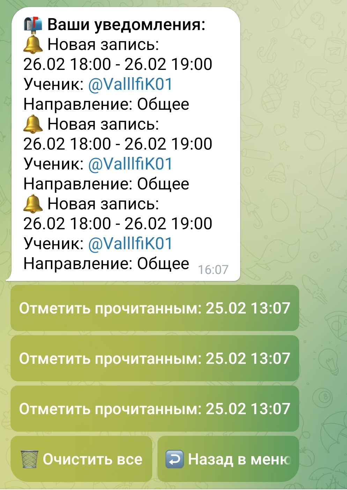

# 🗓️ Tutor Scheduler Bot

Умный Telegram-бот для управления расписанием занятий с автоматическими уведомлениями и удобным интерфейсом.



## 🌟 Особенности

### 👨🏫 Для преподавателей
- 📅 Интерактивный календарь для управления расписанием
- 👥 Просмотр списка учеников
- 🔔 Уведомления о новых записях и отменах
- ⏰ Автоматические напоминания о занятиях
- 📊 Статистика занятости

### 👨🎓 Для учеников
- 🔍 Поиск доступных слотов
- 📝 Запись на занятия в один клик
- 🗑️ Отмена записей
- 🔔 Напоминания о предстоящих занятиях
- 📱 Адаптивное меню

## 🛠 Технологии

- **Язык программирования**: Go 1.19+
- **База данных**: SQLite3
- **Основные библиотеки**:
  - `go-telegram-bot-api` - работа с Telegram API
  - `mattn/go-sqlite3` - драйвер для SQLite
- **Архитектура**: Модульная структура с разделением на:
  - `main.go` - инициализация и запуск
  - `database.go` - работа с БД
  - `handlers.go` - обработчики команд
  - `notifications.go` - система уведомлений
  - `models.go` - модели данных

## 🚀 Быстрый старт

### Требования
- Go 1.19+
- SQLite3
- Telegram-бот токен

### Установка
1. Клонируйте репозиторий:
   ```bash
   git clone https://github.com/yourusername/tutor-scheduler-bot.git

2. Установите зависимости:
   ```bash
   go mod download

3. Настройте окружение:
   ```bash
   export TELEGRAM_BOT_TOKEN="ваш_токен"
   const teacherID = ВАШ_ID // Ваш Telegram ID

4. Запустите бота:
   ```bash
   go run main.go

## Скриншоты интерфейса 📸
| Скриншот              | Описание            |
|-----------------------|---------------------|
|  | Меню преподавателя |
|          | Календарь слотов   |
|  | Запись ученика |
|  | Уведомления     |

## Основные команды
| Команда       | Описание               |
|---------------|-----------------------|
| `/start`      | Начало работы         |
| `/schedule`   | Управление расписанием|
| `/students`   | Список учеников       |
| `/book`       | Записаться на занятие |
| `/mybookings` | Мои записи            |
| `/cancel`     | Отмена записи         |

📂 Структура проекта
--------------------
tutor-bot/
├── main.go          # Ядро приложения
├── database.go      # Работа с SQLite
├── handlers.go      # Обработчики команд
├── notifications.go # Система уведомлений
├── models.go        # Модели данных
├── utils.go         | Вспомогательные функции
└── config/          # Конфигурационные файлы

🔧 Рабочие процессы
-------------------

Преподаватель:
1. Добавление слотов через календарь
2. Просмотр статистики занятости
3. Управление уведомлениями
4. Экспорт расписания

Студент:
1. Поиск доступных слотов
2. Выбор направления обучения
3. Подтверждение записи
4. Получение напоминаний

🔐 Безопасность
---------------
• Валидация всех входящих данных

• Шифрование чувствительной информации

• Ролевая модель доступа

• Защита от SQL-инъекций

📜 Логирование
--------------
• Все действия записываются в лог-файл
• 3 уровня логирования:
  - INFO: базовые события
  - WARN: подозрительные действия
  - ERROR: критические ошибки

📄 Лицензия
-----------
MIT License

Copyright (c) 2023 Бондаренко Влад

Данная лицензия разрешает лицам, получившим копию данного программного обеспечения 
и сопутствующей документации (в дальнейшем именуемыми "Программное Обеспечение"), 
безвозмездно использовать Программное Обеспечение без ограничений, включая 
неограниченное право на использование, копирование, изменение, объединение, 
публикацию, распространение, сублицензирование и/или продажу копий Программного 
Обеспечения, а также лицам, которым предоставляется данное Программное Обеспечение, 
при соблюдении следующих условий:

Указанное выше уведомление об авторских правах и данные условия должны быть 
включены во все копии или значительные части Программного Обеспечения.

ПРОГРАММНОЕ ОБЕСПЕЧЕНИЕ ПРЕДОСТАВЛЯЕТСЯ «КАК ЕСТЬ», БЕЗ КАКИХ-ЛИБО ГАРАНТИЙ, 
ЯВНО ВЫРАЖЕННЫХ ИЛИ ПОДРАЗУМЕВАЕМЫХ, ВКЛЮЧАЯ, НО НЕ ОГРАНИЧИВАЯСЬ ГАРАНТИЯМИ 
ТОВАРНОЙ ПРИГОДНОСТИ, СООТВЕТСТВИЯ ПО КОНКРЕТНОМУ НАЗНАЧЕНИЮ И НЕНАРУШЕНИЯ ПРАВ. 
НИ В КАКОМ СЛУЧАЕ АВТОРЫ ИЛИ ПРАВООБЛАДАТЕЛИ НЕ НЕСУТ ОТВЕТСТВЕННОСТИ ЗА ЛЮБЫЕ 
ИСКИ, УБЫТКИ ИЛИ ИНЫЕ ОБЯЗАТЕЛЬСТВА, БУДЬ ТО В ДЕЙСТВИИ ДОГОВОРА, ПРАВОНАРУШЕНИЯ 
ИЛИ ИНОМ СЛУЧАЕ, ВОЗНИКШИЕ ИЗ, ИМЕЮЩИЕ ПРИЧИНОЙ ИЛИ СВЯЗАННЫЕ С ПРОГРАММНЫМ 
ОБЕСПЕЧЕНИЕМ ИЛИ ИСПОЛЬЗОВАНИЕМ ПРОГРАММНОГО ОБЕСПЕЧЕНИЯ ИЛИ ИНЫМИ ДЕЙСТВИЯМИ 
С ПРОГРАММНЫМ ОБЕСПЕЧЕНИЕМ.

🆘 Поддержка
------------
Разработчик: Бондаренко Влад

Email: ivladok01@gmail.com

Telegram: @ValllfiK01
